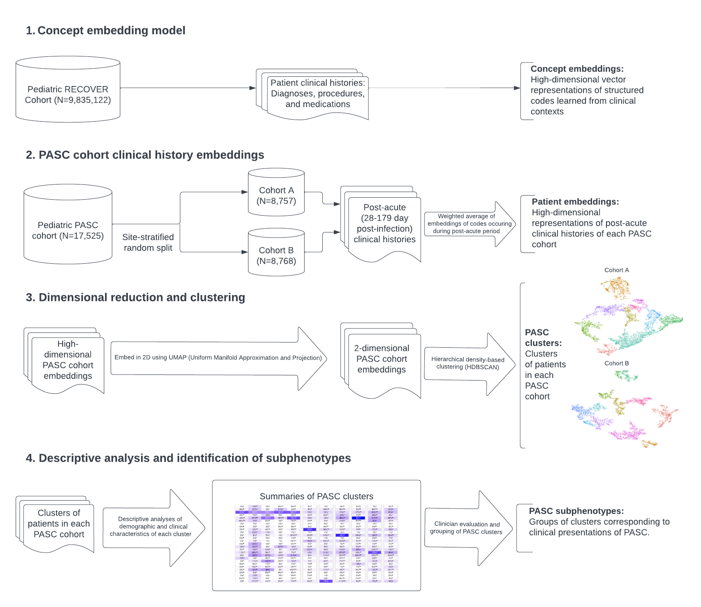

# Pedatric Long COVID Subphenotypes: An EHR-based study from the RECOVER program

## Summary

This repository contains the code for implementing the concept embedding-based Long COVID subphenotyping pipeline used in our manuscript. It includes code for training the full concept embedding model, identifying the Long COVID cohort, producing patient-level embeddings, applying dimensional reduction and clustering, the descriptive and statistical analyses on the clusters, and reproducing the tables and figures in the manuscript.

The pipeline is summarized in the flowchart below:

### Note on the data

This retrospective cohort study is part of the NIH Researching COVID to Enhance Recovery (RECOVER) Initiative, which seeks to understand, treat, and prevent the post-acute sequelae of SARS-CoV-2 infection (22). The RECOVER EHR population includes clinical data for patients at 38 hospital systems across the United States. Data were extracted from version 11A of the pediatric RECOVER database, comprising 9,835,122 patients with evidence of testing or immunization for SARS-CoV-2 or diagnoses of COVID-19 or other respiratory illnesses between January 2019 and December 2022. Institutional Review Board (IRB) approval was obtained under Biomedical Research Alliance of New York (BRANY) protocol #21-08-508. As part of the BRANY IRB process, the protocol has been reviewed in accordance with institutional guidelines. BRANY waived the need for consent and HIPAA authorization. 

The results reported here are based on detailed individual-level patient data compiled as part of the RECOVER Program. Due to the high risk of reidentification based on the number of unique patterns in the date, patient privacy regulations prohibit us from releasing the data publicly. The data are maintained in a secure enclave, with access managed by the program coordinating center to remain compliant with regulatory and program requirements. Please direct requests to access the data, either for reproduction of the work reported here or for other purposes, to (recover@chop.edu).

### Note on the repository structure

The code for this study was developed in both R and Python. Generally, R was used for cohort identification, data manipulation, descriptive and statistical analyses, and reporting tables and figures, and Python was used for training the embedding model, producing patient-level embeddings, dimensional reduction, and clustering. 

Code in this repository is structured following the PEDSnet standard framework, which includes utility function for setting up a database connection and working with OMOP/PEDSnet Common Data Model (CDM) tables through the dbplyr R package (which translates dplyr commands to SQL to run against the database). Connection details are abstracted away in a JSON file not included here. Users without a similar setup may need to do some work to set up a connection to their own OMOP database.

Generally, code for running the pipeline is included in the [code](./code/) subdirectory, codesets (e.g. for diagnoses, labs, etc.) are located in the [specs](./specs/) subdirectory, and R Markdown reports to generate the tables and figures are located in the [reporting](./reporting/) subdirectory. The remaining subdirectories contain various utility functions generic to the standard framework. In R, the files prefaced with 'driver' are where code is run and functions called from these files are located in corresponding files prefaced with 'cohort.'

## Concept embedding model

The training data for concept embedding model consists of sentences constructed from diagnosis/procedure/medication codes occurring during month-long periods (i.e. each patient-month corresponds to a sentence) for all patients in the pediatric RECOVER database. This is the **codes_by_site_aws** table, which is generated in the [driver_model.R](./code/driver_model.R) file and output to the database. 

The model is then trained in the [embeddings_all_sites.ipynb](./code/embeddings_all_sites.ipynb) notebook. Our trained model is included as the files prefaced with **model_all_sites_aws_320_neg** in the [code](./code/) subdirectory.

## Identifying Long COVID cohort

### Cohort identification

The [driver_cohorts.R](./code/driver_cohorts.R) file includes code for identifying the Long COVID cohort (identified using the PASC computable phenotype developed in [Botdorf et al.](https://www.ncbi.nlm.nih.gov/pmc/articles/PMC11142266/) as well as the matched cohort of patients with no evidence of COVID. This file also computes descriptive variables which are summarized in downstream analyses (e.g. presence of existing chronic conditions). The functions called in this driver file are located in the [cohorts.R](./code/cohorts.R) and [cohort_pmca.R](./code/cohort_pmca.R) files.

An auxiliary table, **observation_derivation_recover** was derived from CDM tables to pull in COVID-related rows from CDM tables and implement the PASC computable phenotype. This table is computed in a separate repository [observation_derivation_recover](https://github.com/PEDSnet/PASC/tree/main/observation_derivation_recover_ml_phenotype).

### Sentences

Patient clinical trajectories during the 28-179 day post-index date period are turned into sentences made of diagnosis/procedure/medication codes occuring incidentally during this time. These are computed in [driver_sentences.R](driver_sentences.R). This is also the point at which the Long COVID cohort is split (site-stratified) into cohorts A and B. Sentences are also computed for the matched no evidence of COVID cohort. The functions called here can be found in [cohort_sentences.R](./code/cohort_sentences). Data frames with the sentences corresponding to each cohorts' post-index date trajectories are output to the database.

## Patient level embeddings, dimensional reduction, and clustering

The concept embedding model from step 1 is then applied to embed the cohort sentences produced in step 2. This is carried out twice: once on Cohort A for a grid of hyperparameter values, and, once hyperparameters are fixed, once again on each of Cohort A, Cohort B, and the matched control cohort. This is done in [clustering_grid_search.ipynb](./code/clustering_grid_search.ipynb) for the hyperparameter grid search, [clustering_v2.ipynb](./code/clustering_v2.ipynb) for cohorts A and B, and [clustering_no_evidence.ipynb](./code/clustering_no_evidence.ipynb) for the matched control cohort.

Additionally, the supplementary materials contain a visualization of cluster centroids for all three cohorts in the same space; this was constructed by constructing a combined embedding of all three cohorts (A, B, and control) in [clustering_embed_combined.ipynb](./code/clustering_embed_combined.ipynb).

Functions used at this stage are located in [ce_functions.py](./code/ce_functions.py). Sentence embeddings were constructed using smooth inverse frequency weighting scheme from the [*A Simple and Tough-to-Beat Baseline for Sentence Embeddings*](https://github.com/PrincetonML/SIF) and we used their code. We used the UMAP package for dimensional reduction and HDBSCAN for clustering. 

## Descriptive and statistical analyses and identification of subphenotypes

Descriptive and statistical analyses were conducted to provide clinical interpretations of clusters identified using the pipeline above. Tables for these analyses were produced in [driver_cluster_sum_tables.R](./code/driver_cluster_sum_tables.R) with helper functions located in [cohorts_sum.R](./code/cohorts_sum.R) (and additional code for defining severity of acute infection in [cohort_flags.R](./code/cohort_flags.R)). To go from a grid of 500 hyperparameter values to 4 choices, we used an approach implementing the Variation of Information (VI) metric--this was done in [grid_param_analysis.R](./code/grid_param_analysis.R). 

Finally, reporting of tables and figures in the manuscript can be found in [tables_and_figures_v2_6_13_2024.Rmd](./reporting/tables_and_figures_v2_6_13_2024.Rmd) (with auxilliary tables and figures used for evaluated hyperparameter choices in [top_param_summary.Rmd](./reporting/top_param_summary.Rmd)). 

## Authors

Code for this study was developed by Vitaly Lorman (lormanv@chop.edu).
